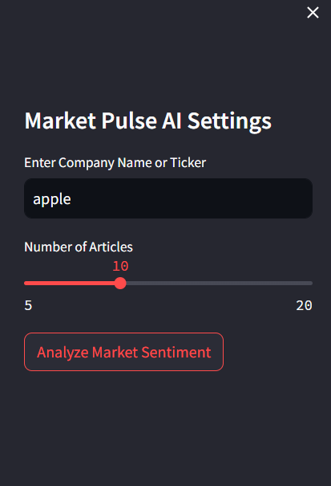
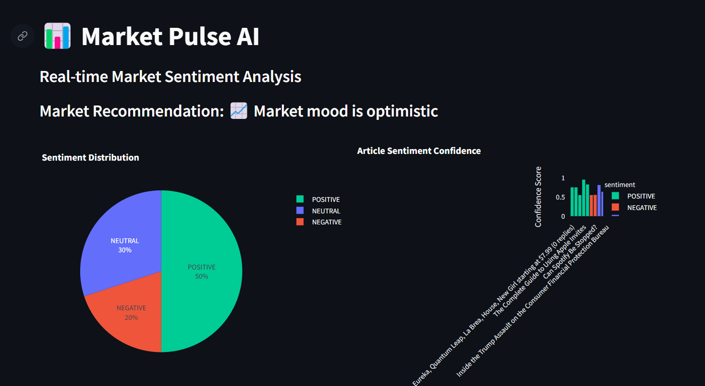
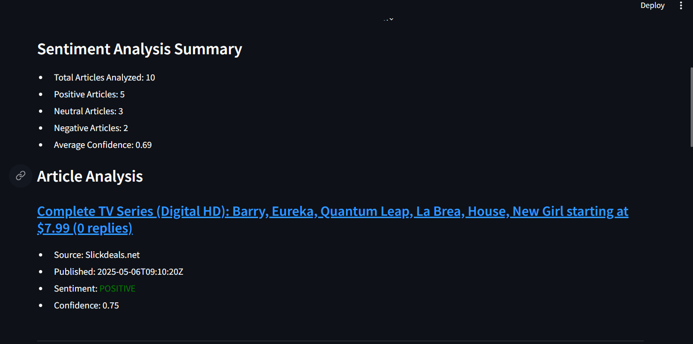

# Market Pulse AI 📊

Market Pulse AI is an advanced sentiment analysis tool that helps investors and analysts understand market sentiment by analyzing news articles about companies or stocks.

## Features

- Real-time news article fetching using NewsAPI
- Advanced sentiment analysis using Hugging Face's RoBERTa model
- Interactive visualizations with Plotly
- Market sentiment recommendations
- Beautiful Streamlit UI with customizable settings

## Screenshots










## Setup

1. Clone the repository:
```bash
git clone <repository-url>
cd market-pulse-ai
```

2. Create a virtual environment and activate it:
```bash
python -m venv venv
source venv/bin/activate  # On Windows: venv\Scripts\activate
```

3. Install dependencies:
```bash
pip install -r requirements.txt
```

4. Create a `.env` file in the project root and add your NewsAPI key:
```
NEWS_API_KEY=your_api_key_here
```

You can get a free API key from [NewsAPI](https://newsapi.org/).

## Usage

1. Start the Streamlit app:
```bash
streamlit run app.py
```

2. Open your browser and navigate to the URL shown in the terminal (usually http://localhost:8501)

3. Enter a company name or stock ticker in the sidebar

4. Click "Analyze Market Sentiment" to see the results

## Project Structure

```
market-pulse-ai/
│
├── app.py                  # Streamlit app
├── news_utils.py          # News scraping utilities
├── sentiment_utils.py     # Sentiment analysis utilities
├── visualizations.py      # Charting code
├── requirements.txt       # Dependencies
└── README.md             # This file
```

## Technologies Used

- Streamlit: Web application framework
- NewsAPI: News article fetching
- Hugging Face Transformers: Sentiment analysis
- Plotly: Data visualization
- Newspaper3k: Article content extraction

## Contributing

Contributions are welcome! Please feel free to submit a Pull Request.

## License

This project is licensed under the MIT License - see the LICENSE file for details. 